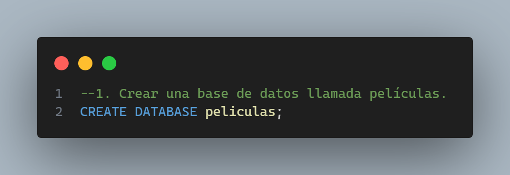
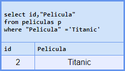

# Desafío Tres

Este repositorio contiene el código del desafío **número 3 del** módulo 5 **Fundamentos de bases de datos relacionales** de la beca Desarrollo de aplicaciones Full Stack Javascript Trainee V2.0 dictada por Desafío Latam. Los requisitos del proyecto son los siguientes:

Para realizar el desafío he utilizado **DBeaver versión 24.0.0**.

A continuación muestro el código y output de mis respuestas a cada pregunta del desafío:

## 1. Crear una base de datos llamada películas

### 1.1. Código

## 2. Cargar ambos archivos a su tabla correspondiente y aplicar el truncado de estas

### 2.1. Código

## 3. Obtener el ID de la película “Titanic”

### 3.1. Código

### 3.2. Output

## 4. Listar a todos los actores que aparecen en la película "Titanic"

### 4.1. Código

### 4.2. Output

## 5. Consultar en cuántas películas del top 100 participa Harrison Ford

### 5.1. Código

### 5.2. Output

## 6. Indicar las películas estrenadas entre los años 1990 y 1999 ordenadas por título de manera ascendente

### 6.1. Código

### 6.2. Output

## 7. Hacer una consulta SQL que muestre los títulos con su longitud, la longitud debe ser nombrado para la consulta como “longitud_titulo”

### 7.1. Código

### 7.2. Output

## 8. Consultar cual es la longitud más grande entre todos los títulos de las películas

### 8.1. Código

### 8.2. Output

